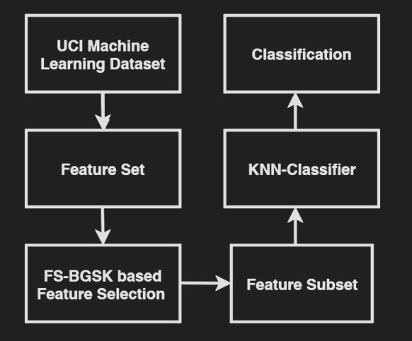

# Seleção de features pelo algoritimo Binary-Gain-share-Knowledge com redução populacional.

## Importante!: Trabalho em andamento.

Todo codigo aqui obviamente esta sujeito a modificações, porem e necessario reforçar TRABALHO EM ANDAMENTO.
Oque falta :
1. Adicionar o .py de graficos
2. Adicionar os experimentos
3. Organizar melhor os notebooks 
4. Compatibilidade com outros datasets dentro do UCI

## Oque já funciona:
O modelo básico já esta em funcionamento.
portanto temos:
feature_selection(data_tuple,num_population:int,nfe_total:int ,lower_k:int,upper_k:int,columns_names)
data_tuple -> x_treino ,x_test, y_treino , y_test
nfe_total -> numero de avaliações maximas, cada individuo e avaliado uma vez a cada geração. Orçamento computacional.
lower_k, upper_k  -> numero minimo e máximo de features.
columns_names: vetor com o nome de todas as colunas.

## Por que e como ?

Decidi implementar este paper [A novel binary gaining–sharing knowledge-based optimization
algorithm for feature selection](https://link.springer.com/article/10.1007/s00521-020-05375-8)
**

## Inspiração de comportamento

Algoritimo baseado em compartilhamento de conhecimento ao longo da vida de um humano.Durante a fase inicial da vida individuos aprendem com aqueles mais proximos e como professores e parentes, em seguida nos tornamos menbros mais ativos de comunidades maiores atravez de redes socias e grandes comunidades. O algoritmo se inspira nesta caracteristica humana, atravez de uma fase inicial em que apenas os individuos com o desenpenho mais proximo são responsavel pela adesão ou abandono de determinadas caracteristicas, em seguida a influencia de individuos mais distantes são levadas em conta.

## Funcionamento do algoritmo.

Cada individuo é formado por um vetor binario de features criado aleatoriamente com um minimo e um maximo de elementos,uma população é feita destes individuos 
valiação inicial, rankeando os melhores individuos, cada individuo possui um vetor binario de features estes que indicam quais features estarão ou não presentes.Em seguida, apos o rankeamento baseado no complemento da accuracia, (1-acuracia) e no complemento da proporção de features (1- features/total).

## Redução de população

O algoritmo possui um numero gerações maximas estipuladas em conjunto com um numero minimo de individuos, a cada geração os algoritmos com o pior desempenho são descartados apos as duas fases de compartilhamento , esse descarte é feito após o compartilhamento afim reduzir as features associadas com o menor desenpenho entre os individuos com melhor desenpenho.desta forma garantindo maior flexibilidade e descartando as piores soluções.
